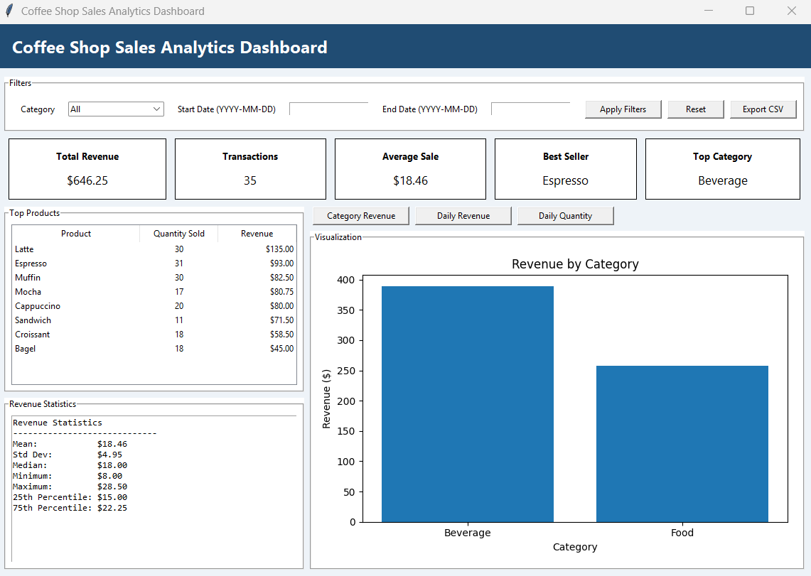
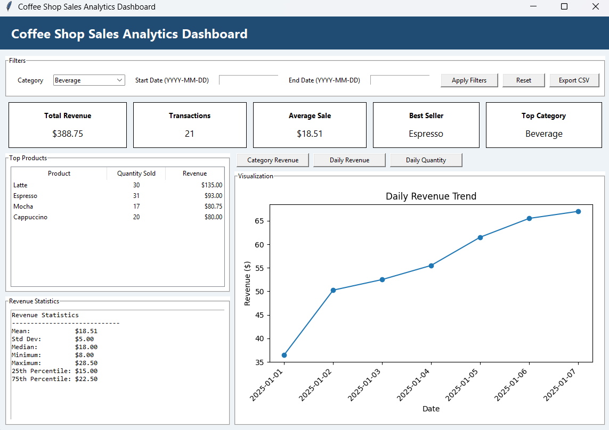
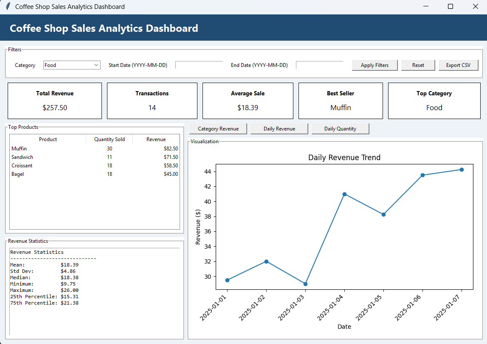

# Coffee Shop Analytics Dashboard

## Overview
A Python-based dashboard for analyzing coffee shop sales data with filtering, visualization, and statistical insights.

## Features
- Load and clean CSV data
- Filter by category and date
- Revenue analysis
- Product performance tracking
- Data visualization
- Export filtered data

## Technologies Used
- Python
- Pandas
- NumPy
- Tkinter
- Matplotlib

## How to Run
pip install pandas numpy matplotlib  
python Coffee Shop Analytics Dashboard.py

## Screenshots

### Dashboard

### Beverage Filter

### Food Filter

## Author
Connor Warming
